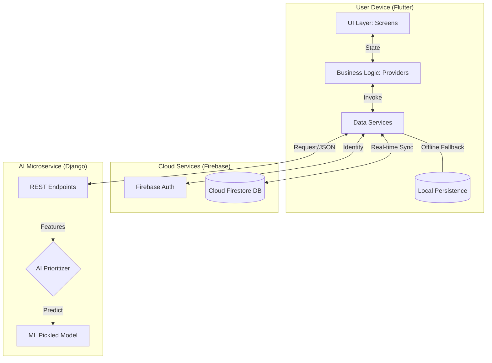

# TaskCue: Technical Appendices

## Appendix A: Detailed Data Dictionary (Cloud Firestore)

### A.1 Collection: `users`
| Field | Type | Description |
| :--- | :--- | :--- |
| `uid` | String | Primary Key (Firebase Auth UID) |
| `displayName` | String | User's chosen display name |
| `email` | String | User's account email address |
| `gamification.totalXP` | Integer | Cumulative lifetime experience points |
| `gamification.currentRank` | String | Current Aether Rank (e.g., Gladiator I) |
| `gamification.currentStreak` | Integer | Consecutive days of task completion |
| `gamification.achievementsUnlocked` | List<String> | Array of unique achievement identifiers |

### A.2 Collection: `tasks` (Sub-collection)
| Field | Type | Description |
| :--- | :--- | :--- |
| `id` | String | Unique task identifier |
| `title` | String | Name of the task |
| `category` | String | Focus area (Work, Health, Personal, etc.) |
| `priority` | Integer | Priority level (1=High, 2=Medium, 3=Low) |
| `status` | String | current state (pending, completed, deleted) |
| `estimatedMinutes` | Integer | Predicted duration for completion |

---

## Appendix B: API REST Endpoint Specifications

| Endpoint | Method | Request Payload (JSON) | Response (JSON) |
| :--- | :--- | :--- | :--- |
| `/api/tasks/` | GET | None | List of all task objects |
| `/api/tasks/` | POST | `{title, category, priority, duration}` | Created task object with ID |
| `/api/tasks/<id>/complete/`| POST | None | status: "success", xp_earned: 45 |
| `/api/analytics/trends/` | GET | `?days=7` | Daily completion chart data |
| `/api/health/` | GET | None | status: "healthy", version: "3.0" |

---

## Appendix C: UI Architecture & Wireframes (Mermaid)

---

## Appendix D: Project Test Cases & Results

| Test ID | Module | Scenario | Expected Result | Status |
| :--- | :--- | :--- | :--- | :--- |
| **TC-01** | Auth | Register new user | Profile initialized in Firestore | **PASS** |
| **TC-02** | Task | Create Task (Offline) | Local cache stores; syncs on reconnect | **PASS** |
| **TC-03** | Gamify | Complete High Priority | 1.5x multiplier applied correctly | **PASS** |
| **TC-04** | Sync | Leaderboard Update | Entry updates within 500ms of task check | **PASS** |
| **TC-05** | Build | Gradle Compilation | Fix JVM 17 & SDK 36 compatibility | **PASS** |

---

## Appendix E: Gamification Formula Reference

### E.1 Base XP Matrix
*   **Low Difficulty**: 10 XP
*   **Medium Difficulty**: 20 XP
*   **High Difficulty**: 35 XP

### E.2 The Final Calculation
**Formula**: `TotalXP = (Base * Priority) + DurationBonus * ChainMultipliers`

**Chain Multipliers**:
*   **Streak**: 1.05x (7 days) ... 1.30x (365 days)
*   **Focus Bonus**: 1.2x (3+ tasks in 1 category today)
*   **Balance Bonus**: 1.15x (3+ unique categories today)
