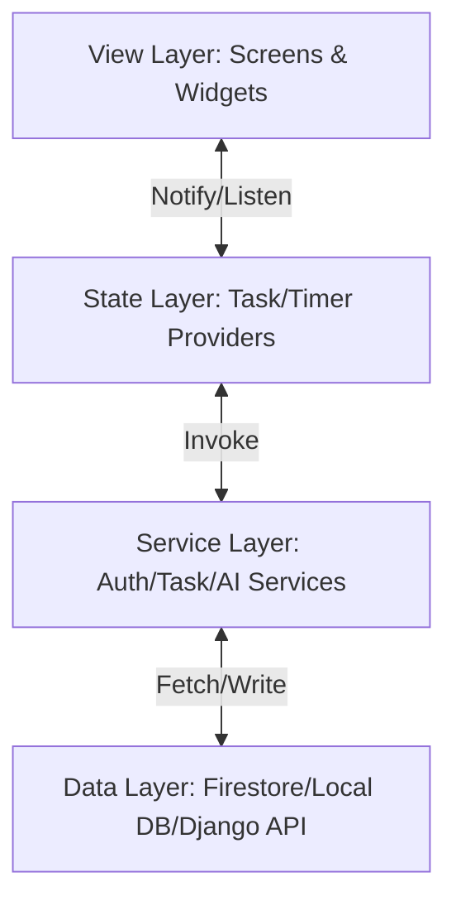

# TaskCue: The Ultimate Gamified Productivity Royale
## Comprehensive Technical Documentation (v3.0)

> 

## 🗺️ Project Documentation
*   **[Main Project Report](file:///c:/Users/LOQ/taskcue_app/REPORT.md)**: Detailed Chapters on Testing, Results, and Future Roadmap.
*   **[Technical Appendices](file:///c:/Users/LOQ/taskcue_app/APPENDICES.md)**: Exhaustive reference for Database Schema, API Endpoints, and Gamification Math.

## 1. Project Overview & Vision
**TaskCue** is a high-performance productivity ecosystem that combines standard task management with **Octalysis-driven Gamification** and **Machine Learning**. 

It is designed to solve the "intent-action gap" by turning daily responsibilities into experience points (XP) that fuel a competitive global leaderboard and personal rank progression.

### 1.1 The Core Mission
To provide a premium, state-of-the-art productivity tool that balances **Focus** (deep work), **Balance** (category variety), and **Competitive Social Dynamics**.

---

## 2. Key Features
- 🚀 **AI Smart Rescheduling**: Intelligent task prioritization using a Django-based ML microservice.
- 🎮 **Aether Rank System**: 19 unique ranks from *Aether III* to *Imperium*.
- 📊 **Dynamic Analytics**: Interactive Heatmaps and Category Distribution charts via Glassmorphic UI.
- 🏆 **Live Global Leaderboard**: Real-time competition synchronized via Cloud Firestore.
- 🔔 **Intelligent Notifications**: Reminder system using local notifications and custom scheduling logic.
- 🌓 **Premium Aesthetic**: Modern Glassmorphic design language with vibrant animations and dark mode support.
- 📶 **Offline Resilience**: Full functional persistence using Firestore's local caching mechanism.

---

## 3. Technology Stack
| Layer | Technologies |
| :--- | :--- |
| **Frontend** | [Flutter](https://flutter.dev) (Dart), Provider (State), flutter_animate |
| **Backend** | [Django](https://www.djangoproject.com/) (Python), Django REST Framework |
| **Infrastructure** | [Firebase](https://firebase.google.com/) (Auth, Firestore, Cloud Suite) |
| **Machine Learning** | Scikit-learn (Priority model), custom Python heuristics |
| **UI/UX** | Google Fonts (*Plus Jakarta Sans*), Glassmorphic Custom Themes |
| **Database** | NoSQL (Firestore), Local Cache (SharedPreferences/SQLite) |

---

## 4. Software Architecture
TaskCue follows a **Layered Service-Provider-View** architecture.



---

## 5. Detailed Source Repository Mapping

### 5.1 Frontend (Flutter - `lib/`)
| Directory | Purpose | Key Files |
| :--- | :--- | :--- |
| **`models/`** | Data Entities | `task.dart`, `user.dart` |
| **`screens/`** | UI Pages | `home_screen.dart`, `leaderboard_screen.dart`, `analytics_screen.dart` |
| **`services/`**| Core Logic | `gamification_service.dart`, `ai_service.dart`, `auth_service.dart` |
| **`providers/`**| State Mgmt | `task_provider.dart`, `timer_provider.dart` |
| **`widgets/`** | Reusable UI | `heatmap_widget.dart`, `glass_card.dart`, `floating_stopwatch.dart` |

### 5.2 Backend (Django - `backend/`)
| App | Purpose | Main Responsibilities |
| :--- | :--- | :--- |
| **`tasks/`** | Task Logic | Priority calculations and persistent stats. |
| **`users/`** | User Logic | Profile synchronization with Firebase. |
| **`analytics/`**| Data Processing| Generating trend data for the mobile app. |
| **`taskcue_backend/`** | Configuration | Project settings and middleware. |

---

## 6. Database Schema (Cloud Firestore)

### 6.1 `users` {Collection}
Stores user profiles and gamification progress.
```json
{
  "uid": "uuid_string",
  "displayName": "User Name",
  "email": "user@email.com",
  "gamification": {
    "totalXP": 4500,
    "currentRank": "Gladiator II",
    "currentStreak": 7,
    "achievementsUnlocked": ["first_oath", "pathfinder"],
    "tasksByCategory": {"Work": 45, "Health": 12}
  }
}
```

### 6.2 `tasks` {Sub-collection}
Stores individual task documents for each user.
```json
{
  "title": "Document Project Architecture",
  "priority": 1,
  "category": "Work",
  "status": "pending",
  "estimatedMinutes": 60,
  "deadline": "TIMESTAMP"
}
```

### 6.3 `leaderboard` {Collection}
Optimized collection for high-speed global ranking reads.
```json
{
  "uid": "uuid_string",
  "displayName": "User Name",
  "totalPoints": 4500,
  "currentLevel": 5,
  "updatedAt": "SERVER_TIMESTAMP"
}
```

---

## 7. API Documentation (Django Microservice)
All endpoints return JSON responses. Authentication is handled via Firebase ID Tokens.

| Method | Endpoint | Description |
| :--- | :--- | :--- |
| `GET` | `/api/tasks/` | Fetch all user tasks. |
| `POST` | `/api/tasks/` | Create a new task. |
| `POST` | `/api/tasks/<id>/complete/` | Mark task as complete and trigger rewards. |
| `GET` | `/api/tasks/stats/` | Retrieve high-level task metrics. |
| `GET` | `/api/health/` | Service health status check. |

---

## 8. Service Class Documentation

### `GamificationService`
The heart of the reward system.
- `calculateTaskXP()`: Applies multipliers (Priority, Duration, Streak, Focus, Balance).
- `awardTaskCompletion()`: Atomically updates user stats and triggers leaderboard sync.
- `calculateRank()`: Maps cumulative XP to the Aether rank hierarchy.

### `AIService`
The bridge to intelligent scheduling.
- `getAIRecommendedOrder()`: POSTs tasks to Django and returns sorted UUIDs.
- `localHeuristicFallback()`: Weighted-Shortest-Job-First (WSJF) logic for offline sorting.

### `AuthService`
Manages identity and profile initialization.
- `signUp()`: Creates Firebase Auth account and initializes Firestore profile.
- `signIn()`: Authenticates and updates `lastActive` timestamp.

---

## 9. Gamification Mathematics
### The Final XP Formula
$$XP_{final} = (BaseXP \times PriorityMult + DurationBonus) \times StreakMult \times FocusBonus \times BalanceBonus$$

| Multiplier | Value | Condition |
| :--- | :--- | :--- |
| **Base XP** | 10 - 35 | Low, Medium, High Difficulty |
| **Priority** | 1.0x - 1.5x | Low, Medium, High Priority |
| **Duration** | +5 to +15 | 30m to 120m+ estimated |
| **Streak** | 1.05x - 1.30x | 7 to 365 days consistent activity |
| **Focus** | 1.2x | 3+ tasks in the SAME category today |
| **Balance** | 1.15x | 3+ DIFFERENT categories today |

---

## 10. Installation & Setup
### Mobile (Flutter)
1. Ensure Flutter SDK `^3.8.0` is installed.
2. Clone the repository and run `flutter pub get`.
3. Place your `google-services.json` in `android/app/`.
4. Run `flutter run`.

### Backend (Django)
1. Install Python `3.10+`.
2. `pip install -r requirements.txt`.
3. `python manage.py migrate`.
4. `python manage.py runserver 8000`.

---

## 11. Project Map (UML)
```mermaid
erDiagram
    USER ||--o{ TASK : manages
    USER ||--|| GAMIFICATION : progress
    TASK }|--|| CATEGORY : belongs_to
    GAMIFICATION ||--o{ ACHIEVEMENT : contains

